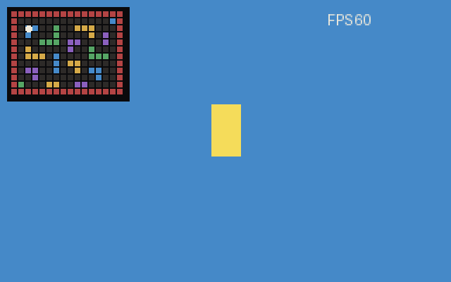

# Proyecto de Graficas

Ray caster simple hecho en Zig para el proyecto de Graficas.

La idea es tener un nivel jugable con paredes de colores diferentes, movimiento del jugador, minimapa y una pequena demo para la entrega.

## Demo



## Como correrlo

```powershell
zig build run
```

## Controles planeados

- `W` y `S` para avanzar y retroceder.
- `A` y `D` para girar la camara.
- `1` y `2` para cambiar de nivel.
- `Enter` para iniciar o pasar al siguiente nivel despues de ganar.
- `Esc` para cerrar el programa.

## Estado

Version final del proyecto. Ya hay ray casting, movimiento del jugador, colisiones contra paredes, FPS en pantalla, minimapa, dos niveles, pantalla de inicio, pantalla de exito y un sprite animado.

Despues de llegar a la salida aparece una pantalla de felicidades con el tiempo que tomo completar el nivel.

## Archivos importantes

- `src/framebuffer.zig`: guarda los pixeles y la funcion `point`.
- `src/player.zig`: movimiento del jugador y colisiones.
- `src/raycaster.zig`: calcula las paredes visibles con rayos.
- `src/map.zig`: mapas, colores y minimapa.
- `src/hud.zig`: textos simples como el contador de FPS.
- `src/sprite.zig`: sprite animado dentro del nivel.
